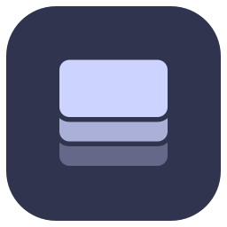
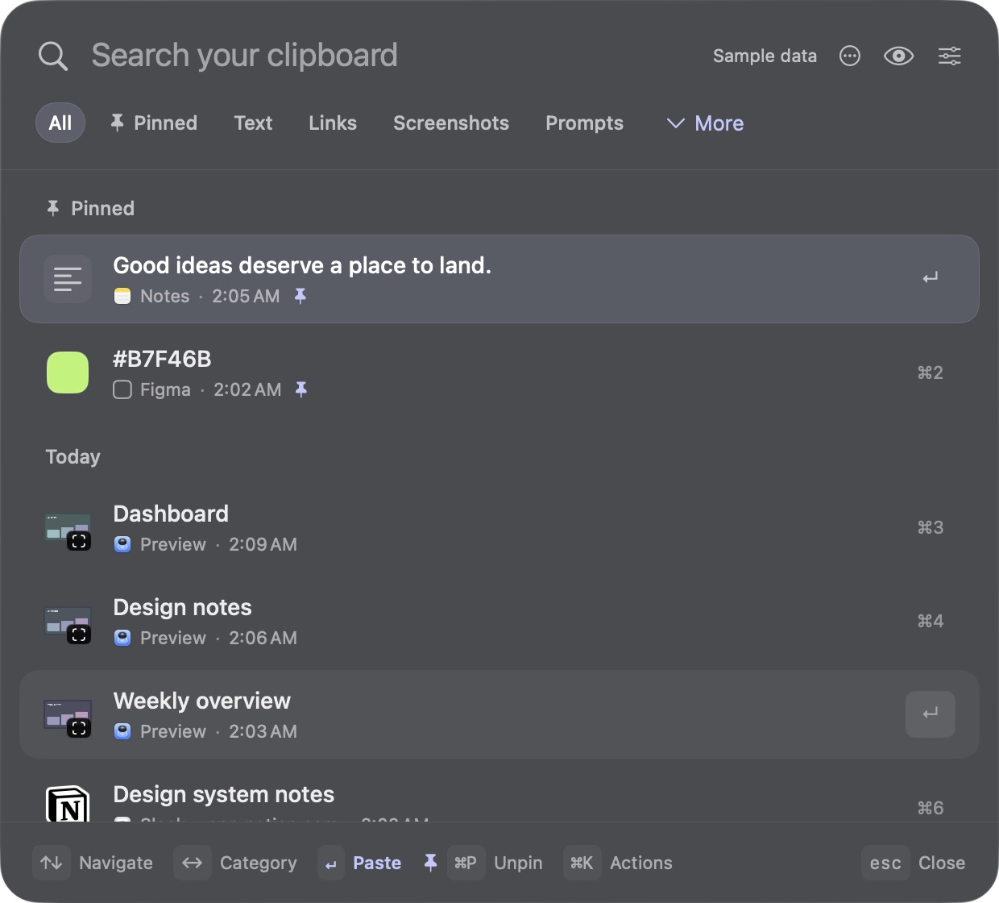

<p align="center">
  
</p>

<h1 align="center">Stash</h1>

<p align="center"><strong>A little more memory for your Mac.</strong><br>
A native, keyboard-first home for everything you copy.</p>

<p align="center">
  <a href="https://github.com/AugmentedMode/Stash/actions/workflows/ci.yml"></a>
  <a href="LICENSE"></a>
  
  
</p>

<p align="center">
  <a href="#get-started">Get started</a> ·
  <a href="docs/USAGE.md">User guide</a> ·
  <a href="CONTRIBUTING.md">Contribute</a> ·
  <a href="https://github.com/AugmentedMode/Stash/issues">Report a bug</a>
</p>

<p align="center">
  
  <br><sub>Captured from the native app using synthetic sample content. No personal clipboard data.</sub>
</p>

Press **⌘⇧V**, find what you copied, and get back to work. Stash keeps text, links,
images, screenshots, colors, and file references together in a small menu-bar app.
Your history stays on your Mac: no account, cloud sync, analytics, or network requests.

## What you can do

- **Find a previous copy.** Search your history, filter by content type, and navigate with the keyboard.
- **Keep the useful things.** Pin clips, give them readable names, and paste without formatting.
- **Recognize your links.** See service icons and readable page or ticket labels derived locally from the original URL.
- **Browse images and screenshots.** Use the thumbnail grid, fitted previews, and zoom. Optionally collect newly saved macOS screenshots.
- **Reuse your prompts.** Save named templates with fields like `{{topic}}` and `{{tone}}`. Fill them in and copy or paste—no AI service involved.
- **Choose what stays.** Pause capture, exclude apps, set retention, or keep clipboard history only for the current session.

Built with **SwiftUI and AppKit**, with Liquid Glass on macOS 26 and native materials
on earlier supported versions. The app has **no third-party runtime dependencies**.

## Get started

### Build from source

**Run:** macOS 14 or later. **Build:** Xcode 26 or matching Apple Command Line Tools
with the macOS 26 SDK. The newer SDK compiles the availability-guarded glass UI;
the deployment target remains macOS 14.

```sh
git clone https://github.com/AugmentedMode/Stash.git
cd Stash
./scripts/build-app.sh release
open dist/Stash.app
```

Click **Start collecting**. Stash stays in the menu bar when you close its window.
You can move the built app to Applications when you are ready to use it regularly.

The build script creates an ad-hoc signed app for your Mac's architecture. It is
not a Developer ID signed or notarized download. See the [release guide](docs/RELEASE.md)
for packaging and public binary distribution.

### Try it with sample data

```sh
STASH_APP_OUTPUT='dist/Stash QA.app' ./scripts/build-app.sh debug
open 'dist/Stash QA.app'
```

The QA app uses synthetic clips, separate preferences, no history files, no capture,
and no global shortcut. Its Copy action still writes to the system clipboard.

### Enable quick paste

Automatic paste needs **Accessibility** permission. Open **Settings → Enable Quick
Paste** and grant access in macOS. Without it, Stash copies the selected item and
returns to your previous app; press **⌘V** there.

## At your fingertips

| Shortcut | Action |
| :--- | :--- |
| **⌘⇧V** | Show or hide Stash |
| **↑ / ↓** | Select a clip |
| **Return** | Paste the selected clip |
| **⇧Return** | Paste without formatting |
| **⌘1–9** | Paste a visible result directly |
| **← / →** | Switch categories; use **⌥← / ⌥→** while searching |
| **⌘P** | Pin or unpin a clip |
| **⌘K** | Open clip actions |
| **⌘Y** | Preview the selected clip |
| **⌘⇧P** | Open saved prompts |
| **⌘,** | Open Settings |
| **Esc** | Go back, clear search, or close the palette |

See the [user guide](docs/USAGE.md) for screenshot setup, prompt fields, and the full workflow.

## Your clipboard, on your Mac

Stash stores data locally in `~/Library/Application Support/Stash/`. Clipboard
history lives in `history.json`; explicitly saved prompts live in `prompts.json`.
The directory and files have owner-only permissions. **They are plaintext JSON,
not an encrypted vault.**

- Unpinned clips expire after **30 days** by default. Choose 1, 7, 30, or 90 days, or keep them indefinitely.
- History retains up to **500 unpinned clips / 200 MB**. Pins are exempt; individual copies above **20 MB** are skipped.
- Session-only mode clears saved clipboard history and discards current clips—including pins—on quit. Saved prompts remain separate.
- Sensitive clipboard markers and common password-manager apps are excluded. **Unmarked secrets from other apps can still enter history.** Add app exclusions or pause capture when needed.
- File clips reference the originals. Moving or deleting a file can make its clip unavailable.
- Screenshot collection is opt-in. Saved screenshots cannot be attributed to an app, so app exclusions do not filter them.

Stash never logs clipboard contents. History writes are coalesced for up to one
second, so an abrupt crash can lose the most recent changes.

## Contributing

Bug reports, focused improvements, documentation, and testing on different Macs
are welcome. Read [CONTRIBUTING.md](CONTRIBUTING.md) before starting.

```sh
./scripts/check.sh             # Build and run 40 isolated core checks
./scripts/format.sh --check    # Check Swift formatting
./scripts/format.sh            # Format Swift source
```

Tests use named pasteboards and temporary directories, not your real clipboard or
history. Run them in a macOS login session. The test runner is an executable,
`StashCoreChecks`, so full Xcode/XCTest is not required; `swift test` is not the entry point.

| Location | Purpose |
| :--- | :--- |
| [`Sources/Stash/Application`](Sources/Stash/Application) | Lifecycle, window, keyboard, monitoring, app state |
| [`Sources/Stash/Features`](Sources/Stash/Features) | History, images, prompts, settings |
| [`Sources/Stash/Design`](Sources/Stash/Design) | Shared visuals and icons |
| [`Sources/StashCore`](Sources/StashCore) | Clipboard data, search, retention, screenshots, persistence |
| [`Tests/StashCoreTests`](Tests/StashCoreTests) | Regression and integration checks |
| [`scripts`](scripts) | Build, checks, formatting, packaging, artwork |

[Architecture](docs/ARCHITECTURE.md) · [Testing](TESTING.md) ·
[Performance](docs/PERFORMANCE.md) · [Security](SECURITY.md)

## License

Stash's original source code and category artwork are licensed under
**GNU GPL version 3 only** (`GPL-3.0-only`). See [LICENSE](LICENSE).

Third-party service icons and trademarks are separate from the GPL grant. See
[THIRD_PARTY_NOTICES.md](THIRD_PARTY_NOTICES.md) for attribution and scope.

Stash is an independent project and is not affiliated with the services shown in its interface.
